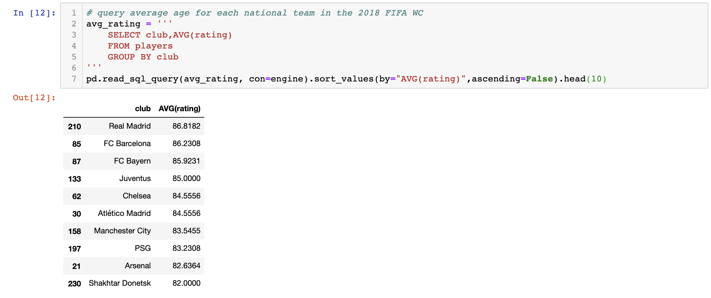

# ETL Project - Soccer Players and World Cup Data

Our project consisted in extracting this data, cleaning the two datasets, and loading tables into our MySQL database.

## Technologies used:
- Python
- Pandas
- pymysql
- SQLAlchemy
- MySQL

## Extract
We have decided to extract two soccer datasets in csv format, one with individual [data on the players](https://www.kaggle.com/karangadiya/fifa19), and the other has [data on the 2018 FIFA World cup squads](https://www.kaggle.com/cclayford/2018-fifa-world-cup-squads). 

## Transform
We have used pandas to create the dataframes from the csv files, and clean the data. Most of the 'transformation' came from dropping columns, changing data types, removing characters cells so we could perform math operations if needed (i.e. {"weight":"78kg"} to {"weight":"78"}), as well as renaming columns so that we could merge the two dataframes.

## Load
We used MySQL workbench to create the database (after some time of "running against the wall" due to encoding problems). 

We then used pymysql and sqlalchemy to load these dataframes as tables in our database.

Here is an example MySQL query that can be done on our database.

